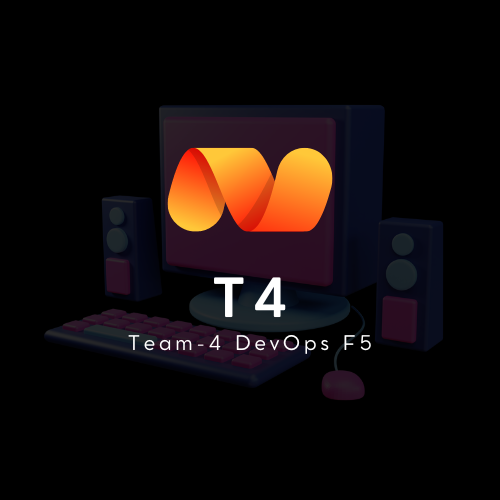

# Welcome to crazy products, don't stop buying today if you were going to buy it tomorrow.
## Getting Started - TEAM4 DevOps F5 

* ## [Oficial Guide of Proyect]()

# Contexto del proyecto:
Bienvenida a Random Shop! Nuestro anterior programador, Mariano, ha dejado la empresa para montar su propia startup de venta de motos usando blockchain. Por suerte, hemos podido contrataros para continuar trabajando en nuestro sistema de venta

Marcos de competencias:
Desarrollar lógica de programación y refactorización.

Descripción de la Kata: 
Qué vendemos?
En Random Shop apostamos por el caos como seña de identidad. Cuando alguien viene a nuestra tienda queremos que se sienta completamente perdida, y que no sepa qué es lo que va a comprar (ni cuánto va a pagar por ello). A día de hoy, nuestro stock se compone de mascotas, productos gourmet, cartas Magic y calzado (outlet). 

### Cuánto cuestan las cosas:
Cartas Magic: The Gathering. Estas cartas tienen un precio variable, dependiendo de su color: Azul 5 euros, Rojo 3.5 euros Verde 4.40 euros, Negro 6.80 euros y Marrón 2.0. La Black Lotus es una carta de coleccionista que vale 40.000 euros.
Mascotas: su precio depende del número de patas y del color. Los animales terrestres tienen un precio de 4.2 euros por cada pata. Los peces tienen un precio dependiendo del color: 10 céntimos los peces azules, 100 euros los peces dorados y el resto de peces tienen un precio base.
Productos gourmet: estos productos dependen de su "edad". Los vinos tienen un precio igual a 20 euros por año, mientras que los quesos apestosos tienen un precio de 10 euros por año.

### Qué nos piden?
Modificación de cartas Magic. La antigüedad de las cartas Magic puede influir en su precio. Las cartas azules y rojas cuestan la mitad cuando tienen más de 10 años. Las cartas negras y verdes cuestan un 20% más cuando tienen más de 20 años.
Arañas mascota. Queremos añadir este nuevo producto a nuestra tienda. El precio de una araña mascota se calcula de la siguiente manera:
1.20 euro por cada pata
+2 euros si son de color rojo, +3 euros si son de color dorado
las arañas apestosas (stinky) están a mitad de precio
Cómo empezar
Añade los tests unitarios para los casos que falten por testear ANTES de COMENZAR CON LOS NUEVOS REQUISITOS
Ejecuta todos los tests cada vez que hagas un cambio en el código
Análisis
Fíjate en la función ShoppingCart::calculatePrice Qué problemas tiene este código?
Es fácil o difícil crear un nuevo producto? Por qué?

### Objetivos de Kata:
1. Desarrollar lógica de programación y refactorización.

2. Comprensión y aplicación de Tests.

### Requisitos del Proyecto:
1. Conocimientos básicos de programación en Java y Test.

### Modalidades de evaluación:Pair Programming, se debe realizar el envío en 3 días. 

### Entregables Esperados:
1. Un programa que cumpla los requisitos mínimos de la Kata.

2. Tests que cubren toda su funcionalidad.

### Recursos Disponibles:
1. Acceso a videos y recursos en línea sobre programación en Java.

2. Soporte y orientación proporcionados por el equipo formativo.

3. Repositorio - GitHub

# Reference Documentation
For further reference, please consider the following sections:

The following guides illustrate how to use some features concretely:

* [Fernando Berzal - Refactoring.pdf-](https://elvex.ugr.es/decsai/java/pdf/8B-Refactoring.pdf)
* [Refactorizar código - Jorge Sánchez Fernández](https://xurxodev.com/refactorizar-codigo/)
* [Diego y María - Factoriaf5/ramdomShop-kata](https://github.com/diegoFactoriaf5/ramdomShop-kata)

# If you have lost your !purchase¡, you will not find the way out anyway 

## Follow me to the next level: 

1º In the repo you will find two branches, one, "do_they_ask", with the original code in which we have added the client's request about the new spider product and the modifications of the others.

2º In the main branch is the refactored code used method extraction, with a half boolean condition check before carrying the method call.